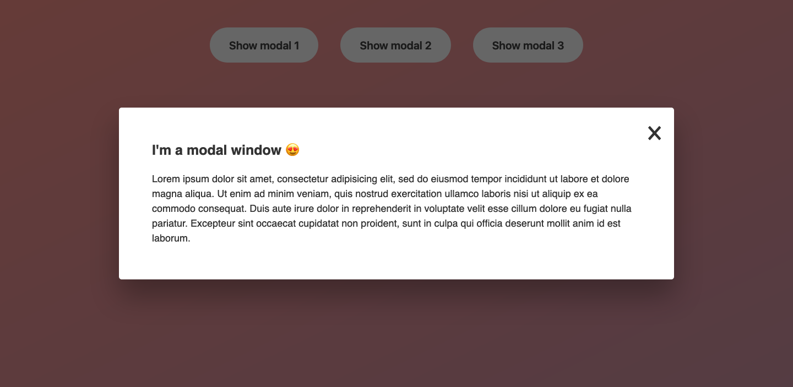

# Table of contents

- [Overview](#overview)
  - [The challenge](#the-challenge)
  - [Screenshot](#screenshot)
  - [Links](#links)
- [My process](#my-process)
  - [Built with](#built-with)

## Overview

### The challenge

Users should be able to:

- Click the buttons and open the modals
- Close the modal with "esc" key, "x" button, and clicking outside the modal

### Screenshot

### Links

- Live Site URL: [https://mw3981.github.io/modal-window/]

## My process

### Built with

- Semantic HTML5
- CSS custom properties
- Flexbox
- Vanilla Javascript
- DOM Manipulation

## Author

- Website - [Michelle Wong](https://michellewong.me/)
